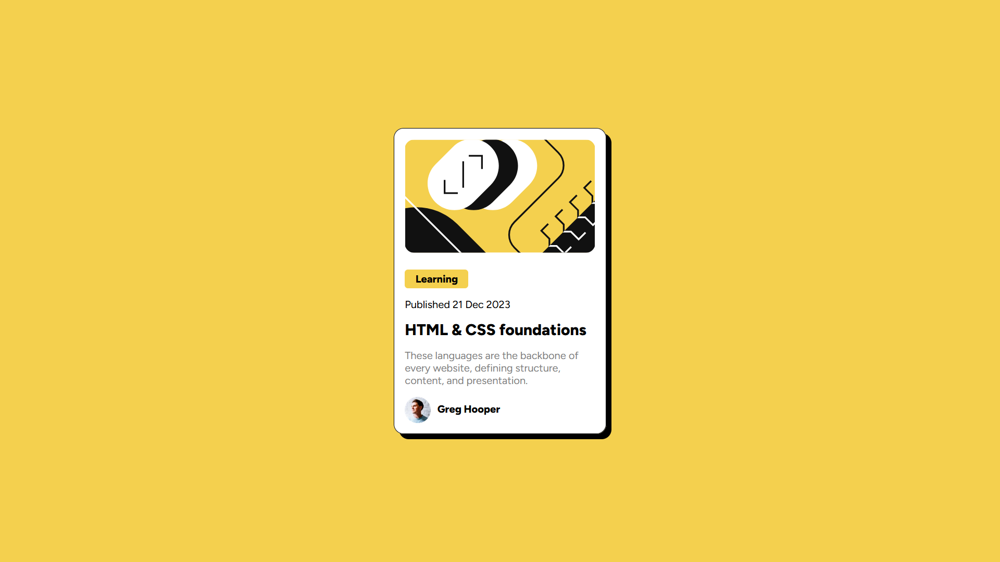

# Frontend Mentor - Blog preview card solution

This is a solution to the [Blog preview card challenge on Frontend Mentor](https://www.frontendmentor.io/challenges/blog-preview-card-ckPaj01IcS). Frontend Mentor challenges help you improve your coding skills by building realistic projects. 

## Table of contents

- [Overview](#overview)
  - [The challenge](#the-challenge)
  - [Screenshot](#screenshot)
  - [Links](#links)
- [My process](#my-process)
  - [Built with](#built-with)
  - [What I learned](#what-i-learned)
  - [Continued development](#continued-development)
  - [Useful resources](#useful-resources)
- [Author](#author)

## Overview

### The challenge

Users should be able to:

- See hover and focus states for all interactive elements on the page

### Screenshot

### Links

- Solution URL: [Solution URL](https://github.com/AlbertoSocorro/blog-preview-card-main)
- Live Site URL: [Live site URL](https://albertosocorro.github.io/blog-preview-card-main/)

## My process

### Built with

- HTML
- CSS
- Flexbox
- Visual Studio

### What I learned

Durante la elaboracion de este proyecto he aprendido a insertar un reset css antes de empezar a modificar la pagina, ya que es necesario para que el resultado final se vea exactamente igual en todos los navegadores.
Ademas, he mejorado el posicionamiento de elementos dentro de una flexbox.

### Continued development

Use this section to outline areas that you want to continue focusing on in future projects. These could be concepts you're still not completely comfortable with or techniques you found useful that you want to refine and perfect.

Tengo que mejorar el posicionamiento de elementos dentro de una flexbox y practicar con los grids.

### Useful resources

No he obtenido ayuda de Internet en la elaboracion de este ejercicio.

## Author

- Frontend Mentor - [@AlbertoSocorro](https://www.frontendmentor.io/profile/albertosocorro)
